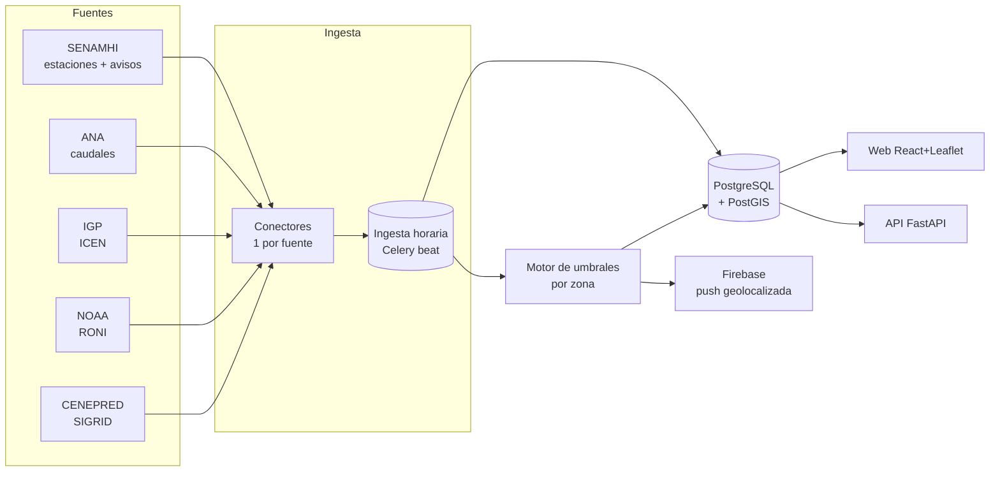

# SIMPAC — Documentación técnica (devs)

> **SIMPAC** — Sistema de Información Meteorológica y Prevención de Anomalías de Cajamarca.
> Plataforma web + app móvil que **centraliza datos hidrometeorológicos de Cajamarca** y
> emite **alertas tempranas de lluvia/crecidas** geolocalizadas.
>
> Este documento es la referencia técnica: arquitectura, conectores de datos, los endpoints
> reales de cada organismo y las partes "peludas" de la ingesta. Para el panorama general
> no técnico, ver la *Pre-documentación general*. Para el catálogo visual de endpoints, ver
> [`fuentes-y-endpoints.html`](./fuentes-y-endpoints.html).

---

## 1. TL;DR / Quickstart

El stack real corre en Docker (§8). Los conectores, el prototipo y las pruebas usan **solo la
librería estándar** de Python (3.10+), así que corren sin instalar nada (desde la raíz del repo):

```bash
python -m unittest discover -s backend/tests -t .   # pruebas sin red ni BD (solo stdlib)

python -m backend.prototipo.demo     # foto rápida en consola (sin BD)
python -m backend.prototipo.ingest   # guarda una pasada en backend/prototipo/simpac.db (SQLite)
python -m backend.prototipo.api      # API JSON del prototipo en http://localhost:8000
```

Salida esperada de `demo` (datos en vivo — foto de Cajamarca): contexto El Niño (RONI/ICEN),
caudales de ríos con su estado de alerta, y la lluvia horaria de una estación automática.

```
NOAA RONI  JJA 2026: +1.36  -> El Niño moderado
IGP  ICEN  2026-05: +1.98  -> Cálida moderada
Mashcón            Mashcon      18:00     0.13 m³/s  (normal)
Yónan Gore         Jequetepeque 21:00      2.3 m³/s  (normal)
...
CUTERVO (4726A602) — 48 horas ; último 2026/09/06 - 21  precip=0.0 mm  temp=13.3 °C
```

---

## 2. Estructura del repo

```
VigiaFEN/
├─ backend/
│  ├─ connectors/
│  │  ├─ _http.py        # helpers GET/POST/descarga binaria (urllib, sin deps)
│  │  ├─ senamhi.py      # estaciones + serie horaria (lluvia/temp)
│  │  ├─ ana.py          # caudales de ríos + estado de alerta por umbral
│  │  ├─ igp.py          # Índice Costero El Niño (ICEN)
│  │  ├─ noaa.py         # RONI (contexto ENSO global, índice oficial de NOAA desde feb-2026)
│  │  ├─ enfen.py        # comunicado oficial ENFEN (estado de alerta) + ICEN del Informe Técnico (PDF)
│  │  └─ idesep.py       # catálogo GeoNetwork de SENAMHI: shapefile -> GeoJSON (no lo importa __init__)
│  ├─ ingesta/
│  │  ├─ recolectar.py   # baja de todas las fuentes en paralelo -> Pasada (no toca la BD)
│  │  ├─ guardar.py      # escribe una Pasada en Supabase (una transacción)
│  │  ├─ departamentos.py # slugs de SENAMHI y nombres canónicos de departamento
│  │  └─ enfen.py        # tarea 'enfen' (cada 6 h): comunicado + ICEN del Informe Técnico
│  ├─ mapas/
│  │  └─ cargar_fen.py   # carga los mapas históricos de eventos El Niño a la tabla mapa
│  ├─ prototipo/         # versión sin dependencias (SQLite + http.server), congelada
│  ├─ tests/             # pruebas sin red (unittest)
│  ├─ app.py             # API FastAPI async (Docker)
│  ├─ celery_app.py      # worker + beat (ingesta horaria, refresco del snapshot)
│  ├─ config.py          # variables de entorno, en un solo lugar
│  ├─ db.py              # conexión a Supabase para quien escribe (worker, cargadores)
│  ├─ snapshot.py        # panorama cacheado en Redis que sirve la API
│  ├─ alerts.py          # motor de umbrales (lluvia + caudal)
│  └─ requirements.txt   # + requirements-mapas.txt (geopandas, solo worker)
├─ frontend/             # React + Vite + Leaflet (ver frontend/README.md)
├─ supabase/
│  ├─ migrations/        # historia de la BD: un archivo por cambio, en orden
│  └─ schema.sql         # foto consolidada del estado final
└─ docs/
   ├─ README-tecnico.md          (este archivo)
   ├─ ESTADO.md                  (dónde estamos)
   ├─ catalogo-idesep.md         (catálogo de mapas de IDESEP)
   ├─ fuentes-y-endpoints.html   (catálogo visual de endpoints)
   └─ pre-documentacion-general.html
```

---

## 3. Arquitectura

Principio: **un conector aislado por organismo** que normaliza su fuente a estructuras
simples. La ingesta (Celery beat, cada hora) guarda en PostgreSQL/PostGIS (Supabase). La web
(React + Leaflet) lee **Supabase directo** con la llave pública, protegida por RLS. La API
(FastAPI) sirve un resumen cacheado en Redis para otros consumidores (app móvil, terceros).



### 3.1. Convención de un conector

Cada módulo expone funciones puras que devuelven `@dataclass`/listas; **no** guardan estado
ni tocan la BD (de eso se encargan los jobs). Así son testeables y cacheables.

---

## 4. Verificación de "tiempo real" (importante)

No basta con asumirlo; se verificó contra la hora del sistema (Perú, UTC−5):

| Fuente | Endpoint | Última marca observada | Frecuencia | ¿Tiempo real? |
|---|---|---|---|---|
| SENAMHI (est. automática) | `map_red_graf.php` | `2026/09/06 - 21h` (hora en curso, 21:15) | horaria | **Sí** |
| ANA (caudales) | `ReporteNacionalCaudal` | `HORA` hasta `21:00` (RPT 592-2026) | ~horaria | **Sí** |
| IGP ICEN | `ICEN.txt` | mes en curso | mensual | contexto |
| NOAA RONI | `RONI.ascii.txt` | trimestre en curso | mensual | contexto |
| ENFEN | comunicado + Informe Técnico (PDF) | quincenal / mensual | quincenal | estado oficial de alerta |

**Conclusión:** la lluvia (SENAMHI) y el caudal (ANA) se actualizan a la hora en curso —
suficiente para disparar alertas. ICEN/RONI son contexto estacional (El Niño), no gatillan
alertas inmediatas pero alimentan el modelo predictivo y el titular.

---

## 5. Conectores — referencia de endpoints

### 5.1. SENAMHI — estaciones y lluvia horaria

**Inventario de estaciones** (HTML con un array JS `PruebaTest` embebido):

```
GET https://www.senamhi.gob.pe/mapas/mapa-estaciones-2/?dp=cajamarca
```
```js
{"nom":"AUGUSTO WEBERBAUER","cate":"MAP","lat":-7.1675,"lon":-78.49309,
 "ico":"M","cod":"107028","estado":"REAL"}
```
- `ico`: `M` meteorológica · `H` hidrológica.
- `estado`: `REAL` (convencional, 07/13/19h) · `DIFERIDO` · `AUTOMATICA` (**telemetría horaria** → las útiles para alertas).

**Serie horaria por estación** (config de Highcharts embebida en el HTML, **sin CAPTCHA**):

```
GET .../map_red_graf.php?cod={cod}&estado={estado}&tipo_esta={M|H}&cate={cate}&cod_old={cod_old}
```
El parser extrae `xAxis.categories` (timestamps `YYYY/MM/DD - HH`) y las `series[].data`
(precip mm/h y temp °C). **Gotcha:** los textos vienen con escapes `\uXXXX` del lado del
servidor; se busca por palabra clave antes del escape (`"Precipitaci"`, `"Temperatura"`).

```python
from backend.connectors import senamhi
autos = senamhi.estaciones_automaticas("cajamarca")
serie = senamhi.datos_horarios(autos[0])
print(serie.ultimo, serie.precip_acumulada(24))
```

> **Histórico bloqueado por CAPTCHA.** La pestaña "Tabla" (mensual, desde 2021-10) usa
> Cloudflare Turnstile y postea a `__dt_est_tp_0s3n@mH1.php`. **No se automatiza ni se evade.**
> Para series largas usar PISCO o la descarga oficial. El gráfico de 48 h sí es libre.

**Avisos meteorológicos** (tabla HTML, nivel amarillo/naranja/rojo):
```
GET https://www.senamhi.gob.pe/?p=aviso-meteorologico
```
Columnas: `Aviso · Nro · Emisión · Inicio · Fin · Duración · Nivel`. Filtrar títulos de
"SIERRA NORTE"/Cajamarca. (Conector pendiente — es scraping de tabla.)

### 5.2. ANA — caudales de ríos (inundaciones)

```
POST https://snirh.ana.gob.pe/onrh/ServicioReportes.asmx/ReporteNacionalCaudal
Content-Type: application/json; charset=UTF-8
body: {pTipoRPT:1, pFecha:"dd/mm/aaaa", pCodAAA:"00", pCodALA:"00", pCodUbigeo:"00"}
```
**Gotchas del ASMX:**
- El cuerpo **no** es JSON estándar (claves sin comillas) — es el string que arma la web.
  Un `{}` vacío devuelve **HTTP 500**; hay que mandar los 5 parámetros. `"00"` = todos.
- `pFecha` es `dd/mm/aaaa`. La respuesta llega como `{"d":[ ... ]}`.

Cada estación trae su **propio umbral** de alerta y emergencia:
```json
{ "DEPARTAMENTO":"Cajamarca","RIO":"Mashcon","ESTACION":"Mashcón",
  "VALOR":"0.13","UNIDADMEDIDA":"m³/s","UALERTA":"14.00","UEMERGENCIA":"18.00",
  "TENDENCIA":"Ascendente","HORA":"18:00","LONGITUD":"-78.4783","LATITUD":"-7.165" }
```
Estado de riesgo (implementado en `ana.EstacionCaudal.estado`):
```
umbrales de crecida (UEMERGENCIA >= UALERTA):     umbrales de NIVEL BAJO (UEMERGENCIA < UALERTA):
VALOR ≥ UEMERGENCIA  -> emergencia                VALOR ≤ UEMERGENCIA  -> emergencia
VALOR ≥ UALERTA      -> alerta                    VALOR ≤ UALERTA      -> alerta
si no                -> normal                    si no                -> normal
(s.d. si falta valor o umbral)
```
> **Gotcha de temporada:** en temporada seca ANA cambia, en algunos ríos amazónicos, a umbrales
> de **nivel bajo** (vaciante): el peligro es que el río baje (navegación). Se reconocen porque el
> de emergencia queda por debajo del de alerta. Ej. Enapu Perú (Iquitos): mar-jul 116.50/117.00,
> desde agosto 108.78/107.97. Leerlos como crecida daba "emergencia" falsa. Esas alertas son de
> tipo `nivel_bajo` y el mapa no dibuja zona de desborde. `RPT_PERIODO` no sirve para saberlo
> (dice "PERÍODO DE ESTIAJE" todo el año). ANA no publica el nivel amarillo que usa SENAMHI.
>
> El reporte de un día solo trae las estaciones que YA midieron ese día (de madrugada viene casi
> vacío): la ingesta pide ayer y hoy. Hay estaciones homónimas (San Pedro en el Charanal y en el
> Santa): la clave es (estación, río, fecha, hora).
Cajamarca aporta ~12 estaciones (Mashcón —río de la ciudad—, Jesús Túnel, Namora Bocatoma,
Corral Quemado, Chotano, Puente Crisnejas, Yónan Gore, Cañad, …). Ojo: `UNIDADMEDIDA` puede
ser `m³/s` (caudal) **o** `m` (nivel).

**Capas del mapa** (visor por cuenca, para contexto/cruce):
```
POST .../VisorPorCuenca/ServicioGeneral.asmx/ListarMapaGEO   -> [{I,D,O,C:[lon,lat]}]
Visor: https://snirh.ana.gob.pe/VisorPorCuenca/?IdVar={N}
```
IdVar: `228` ríos · `46` embalses · `39` emergencias hídricas · `106` SAMAQ (activación de
quebradas/huaycos) · `220` puntos críticos. **39 y 106 son ideales para el cruce con
reportes ciudadanos.**

### 5.3. IGP — ICEN (contexto El Niño Costero)

```
http://met.igp.gob.pe/datos/ICEN.txt        # yy  mm  ICEN  (líneas '%' = comentario)
http://met.igp.gob.pe/datos/ICEN_91_20.txt  # base 1991-2020 (= base NOAA)
http://met.igp.gob.pe/datos/ICENr.txt       # ITCEN: valor reciente/provisional
```
> **HTTP-only** (Apache 2.2, puerto 80). Una web servida por HTTPS **no puede** hacer
> `fetch` a `http://` (mixed content). El **backend descarga y proxyea** el archivo (cachear
> a diario).

Categorías en `igp.categoria()`, según la **Nota Técnica ENFEN 01-2024** (la que citan los
comunicados de 2026): neutra -0.7 a +0.5 · cálida débil hasta +1.3 · moderada hasta +2.1 · fuerte
hasta +3.5 · extraordinaria encima. Los cortes antiguos (2012: 0.4/1.0/1.7/3.0) fallaban en 6 de 11
meses. Para las condiciones frías el ENFEN usa percentiles sin cortes numéricos: se dice "Fría".

> **El IGP se atrasa:** en setiembre 2026 `ICEN.txt` seguía en mayo (Last-Modified 06-07-2026),
> mientras el ENFEN ya había publicado julio (+3.38) y un estimado de agosto (+3.73). La tabla
> `indice` guarda el mes más nuevo de los dos (columna `origen`: IGP o ENFEN).

### 5.3.1. ENFEN — comunicado oficial (estado del Sistema de Alerta)

El ENFEN publica cada ~2 semanas un comunicado en PDF con el **estado del Sistema de Alerta**
(Vigilancia / Alerta de El Niño o La Niña costeros, No activo) y la fecha del próximo. No hay API:
`connectors/enfen.py` descubre el último comunicado (gob.pe, SENAMHI, web ENFEN), baja el PDF y
extrae el texto con `pypdf` (solo en el worker). La tarea Celery `enfen` corre cada 6 h en el mismo
worker y beat de la ingesta (y una vez al arrancar), y guarda en `comunicado_enfen`.

Los comunicados no traen el valor del ICEN: sale de la Tabla 3 del **Informe Técnico ENFEN** (SENAMHI
y gob.pe, ~17 MB), que se escribe en `indice` como `ICEN` e `ICEN_TMP` con origen ENFEN.
- **Se baja solo si es un informe nuevo.** El latido `enfen` guarda el informe leído (`informe`):
  URL, fecha de publicación, número, portada y alias, que son otras URL del mismo informe. Una
  candidata con la misma URL o fecha de publicación no se baja, ni una más vieja. Si la portada
  resulta igual a la del leído, la URL queda como alias. Si es anterior, se descarta.
- **Informe que se bajó pero no sirve** (PDF ilegible, sin la tabla, meses fuera de rango): queda en
  `informe_fallido` y no se vuelve a bajar antes de 24 h. Los errores de red se reintentan en
  cada corrida.
- **Comunicado e informe son independientes:** si falla uno, el otro se guarda igual. La falla
  queda en `fallas` y `avisos` del latido. Si fallan los dos, la tarea termina en error.

Corrida suelta: `docker compose run --rm worker python -m backend.ingesta.enfen`.

### 5.4. NOAA / CPC — RONI (contexto ENSO global)

```
https://www.cpc.ncep.noaa.gov/data/indices/RONI.ascii.txt   # SEAS YR ANOM (ANOM = RONI)
```
Texto plano, HTTPS, sin auth. **Desde febrero de 2026 el CPC vigila El Niño con el RONI** (el ONI
relativo al calentamiento de todo el trópico), no con el ONI clásico (`oni.ascii.txt`): en jun-ago
2026 el RONI daba +1.36 y el ONI +1.80. `≥ 0.5` El Niño, `≤ -0.5` La Niña; magnitud en pasos de
0.5 (débil, moderado, fuerte, muy fuerte ≥ 2.0). El CPC puede corregir un valor hasta 2 meses después.

### 5.5. CENEPRED — SIGRID (peligro/riesgo, referencia)

Visor ArcGIS JS 3.41. Config del escenario:
```
POST https://sigrid.cenepred.gob.pe/sigridv3/entorno/traer
  -> { extension, mapa_base, shape(WKT), capas_activas:"cartografiaPeligros=[…];
       cartografiaRiesgos=[…]; elementosExpuestos=[…]" }
```
Capas servidas por **ArcGIS REST (MapServer/FeatureServer)** → `identify`/`query` o WMS.
Uso: capa de contexto de riesgo y para el **cruce** (¿el reporte cae en zona de peligro alto?).
No es tiempo real. *Pendiente:* capturar la URL exacta del MapServer activando una capa.

### 5.6. ENFEN — estado de alerta El Niño Costero

Implementado: ver §5.3.1 (`connectors/enfen.py`). No se usa el `wp-json` del WordPress del ENFEN
(no existe su API REST y su DNS no resuelve desde Docker): el comunicado y el Informe Técnico se
descubren en gob.pe y SENAMHI y se leen del PDF con `pypdf`. El ICEN al día sale del Informe
Técnico (Tabla 3), no del comunicado ni del IGP (que se atrasa).

### 5.7. IDESEP (SENAMHI) — mapas históricos de eventos El Niño

IDESEP es el catálogo GeoNetwork de SENAMHI. Conector: `backend/connectors/idesep.py`.
```
GET https://idesep.senamhi.gob.pe/geonetwork/srv/eng/csw?service=CSW&request=GetRecords&...
    -> catálogo paginado (dc:identifier = uuid, dc:title = título)
GET https://idesep.senamhi.gob.pe/geonetwork/srv/api/0.1/records/<uuid>
    -> página HTML con el enlace al .zip del shapefile (dentro de /attachments/)
```
El .zip se convierte a GeoJSON (EPSG:4326) con **geopandas**, que se importa solo dentro de
`geojson_de_registro()`. `idesep` no se importa desde `connectors/__init__.py`, así los demás
conectores siguen sin dependencias. Los 5 eventos cargados tienen su **uuid fijo** en
`EVENTOS_FEN` (`cargar_fen.py`); para sumar uno nuevo basta su título, que se busca en el catálogo
de forma normalizada (sin distinguir mayúsculas, tipo de guion ni espacios). Solo se descargan
adjuntos del propio `idesep.senamhi.gob.pe` por HTTPS, con tope de 80 MB y reintentos ante fallas
de red (los errores 4xx no se reintentan).

Mapas cargados en la tabla `mapa` con `variable='FEN'` (el mensual usa `variable='precipitacion'`):

| Evento | periodo | Polígonos |
|---|---|---|
| El Niño 82-83 | 1982-1983 | 2620 |
| El Niño 97-98 | 1997-1998 | 1694 |
| El Niño Costero 2017 | 2017 | 1590 |
| El Niño Costero 2023 | 2023 | 944 |
| El Niño 2023-2024 | 2023-2024 | 2197 |

Cada feature trae solo la propiedad `RANGO` (rango de anomalía en texto, p. ej. `"-120 - -60"`).
Cobertura nacional; pesan hasta ~5.5 MB cada uno.

**Carga** (única vía de escritura; son mapas estáticos, no van en la ingesta horaria):
```bash
docker compose run --rm worker python -m backend.mapas.cargar_fen            # prueba en seco
docker compose run --rm worker python -m backend.mapas.cargar_fen --aplicar  # upsert por uuid
```
Opciones: `--simplificar 0.005` (aligerar geometrías), `--decimales 5`, `--exportar DIR`
(GeoJSON para `backend/mapas/visor_geojson.html`), `--catalogo` (lista uuid + título).
El upsert usa el índice único `mapa_uuid_key`, así que correrlo varias veces no duplica filas.
Sale con código 1 si algún evento falla o no aparece en el catálogo.

Para `--exportar` dentro de Docker hay que montar una carpeta del host (con `--rm` el contenedor
se borra y los archivos con él). En PowerShell:
```powershell
docker compose run --rm -v "${PWD}/backend/mapas:/out" worker python -m backend.mapas.cargar_fen --exportar /out
```
En Git Bash hay que desactivar la conversión de rutas de MSYS (si no, `/out` se vuelve
`C:/Program Files/Git/out`):
```bash
MSYS_NO_PATHCONV=1 docker compose run --rm -v "$PWD/backend/mapas:/out" worker python -m backend.mapas.cargar_fen --exportar /out
```
geopandas solo está en la imagen del **worker** (`requirements-mapas.txt`, build arg
`INSTALAR_MAPAS=1`); la imagen de la API no lo trae.

> **Legal:** los GeoJSON de SENAMHI ya no se guardan en el repo (`backend/mapas/*.geojson` está en
> `.gitignore` y `.dockerignore`), aunque el archivo que se subió antes sigue en el historial de git
> hasta el commit `aaf5aaa`; borrarlo de ahí requiere reescribir el historial (decisión del equipo).
> Los mapas viven en la tabla `mapa`, que es de **lectura pública** vía la API de Supabase (como el
> resto de datos oficiales), siempre con la atribución a SENAMHI/IDESEP.

---

## 6. Motor de alertas y predicción

**Alertas (reactivas, tiempo real):** el motor compara, por zona de Cajamarca, las entradas
horarias contra umbrales:
- **Lluvia** (SENAMHI automáticas): umbral configurable por estación (mm/h y acumulado 24 h).
- **Caudal** (ANA): usa los umbrales `UALERTA`/`UEMERGENCIA` que la propia fuente entrega.
- **Aviso oficial** (SENAMHI): eleva el nivel cuando el aviso aplica a la zona.

El nivel resultante (normal/aviso/alerta/emergencia) alimenta el titular, el mapa y la push
(Firebase). En fase 2 se **cruza con los reportes ciudadanos** para ponderar su confianza
(un reporte en zona con alerta oficial pesa más).

**Predicción (fase 2+):** con la serie horaria histórica por estación (48 h de SENAMHI +
acumulación propia en la BD) se puede:
1. Empezar simple: **tendencia + umbral** (p. ej. precip acumulada creciente + pronóstico
   de aviso) → probabilidad de crecida en las próximas horas.
2. Luego un modelo de series de tiempo por estación (el ICEN/RONI entran como features de
   contexto estacional El Niño). Guardar histórico propio es clave: las fuentes solo dan
   ventanas cortas en tiempo real (SENAMHI 48 h) y el resto está tras CAPTCHA.

---

## 7. Persistencia, ingesta y API

### 7.1. Producción (Supabase + worker)

**Ingesta** (`backend/ingesta/`, la corre el worker cada hora):
1. `recolectar()` baja, en paralelo, el inventario de los 24 departamentos de SENAMHI (982
   estaciones; ojo, un slug mal escrito no da error: SENAMHI devuelve todo el país), la lluvia
   horaria de las estaciones automáticas de `SIMPAC_LLUVIA_DEPTS`, el reporte de ANA de **ayer y
   hoy** (fechas de Perú; el de un día solo trae las estaciones que ya midieron, y de madrugada
   viene casi vacío) y los índices IGP/NOAA. Cada fuente va protegida por separado: si una
   falla, queda anotada en `Pasada.fallas` y la corrida sigue.
2. `guardar()` escribe todo en una transacción. Las horas de SENAMHI se guardan con zona horaria
   (`medido_en`, UTC-5). **Regla de alertas:** solo se reemplazan las de las estaciones que se
   volvieron a evaluar con dato (si ANA o una estación no respondió, su alerta se queda) y las
   que nadie refresca caducan a las 6 h.
3. El resultado de la tarea Celery es el resumen: `estaciones`, `lluvia`, `caudal`, `alertas`,
   `fallas`. Corrida suelta: `docker compose run --rm worker python -m backend.ingesta`.

**BD:** la estructura está en `supabase/migrations/` (historia) y `supabase/schema.sql` (foto).
`lectura_caudal` es el historial; la vista **`caudal_actual`** da la última lectura de ayer u
hoy de cada estación (es la que usan el mapa y el snapshot). Todo cambio de BD va como
migración nueva.

### 7.2. Prototipo (sin dependencias, congelado)

`backend/prototipo/` es la primera versión del flujo **fuentes → ingesta → BD → API**, toda con la
librería estándar. Sirve para mostrar los conectores sin Docker ni Supabase; no se usa en producción.

**Persistencia** (`prototipo/store.py`, SQLite en `backend/prototipo/simpac.db`). Esquema:

| Tabla | Contenido | Clave / dedup |
|---|---|---|
| `estacion` | inventario (cod, nombre, tipo, cat, estado, lat/lon) | `cod` (upsert) |
| `lectura_lluvia` | serie horaria precip/temp por estación | `(cod, ts)` |
| `lectura_caudal` | caudal por estación + umbrales + estado | `(estacion, fecha, hora)` |
| `indice` | último RONI / ICEN | `fuente` |
| `alerta` | alertas vigentes (se reescriben cada corrida) | autoincrement |

**Ingesta** (`prototipo/ingest.py`): una pasada = inventario + lluvia (automáticas) + caudales +
índices + recálculo de alertas. Última corrida real: `93 estaciones, 672 filas de lluvia,
12 de caudal, 0 alertas` (estiaje). Programarla **cada hora**:

```bash
# Linux/mac (cron):     0 * * * *  cd /ruta/VigiaFEN && python -m backend.prototipo.ingest
# Windows (Programador de tareas): acción -> python  argumentos -> -m backend.prototipo.ingest
```
Acumular estas pasadas es lo que construye el histórico propio para el modelo predictivo.

**API** (`prototipo/api.py`, `http.server`, CORS abierto):

| Método | Ruta | Devuelve |
|---|---|---|
| GET | `/api/snapshot` | contexto (RONI/ICEN) + resumen + alertas + caudales |
| GET | `/api/estaciones` | inventario de Cajamarca |
| GET | `/api/caudales` | última lectura por estación, con `estado` |
| GET | `/api/lluvia?cod=107028` | serie horaria de una estación |
| GET | `/api/alertas` | alertas vigentes |
| GET | `/api/contexto` | índices El Niño |

> En producción esto ya lo hacen Supabase (PostgreSQL + PostGIS), `backend/ingesta/` y la API
> FastAPI (§8). `prototipo/api.py` no se usa en prod (sin validación, sin auth).

---

## 8. Despliegue con Docker (producción)

Stack completo en `docker-compose.yml` (4 servicios):

| Servicio | Qué es | Puerto |
|---|---|---|
| `frontend` | React build servido por **nginx** | 8080 |
| `backend` | API **FastAPI async** (`backend/app.py`) | 8000 |
| `worker` | **Celery + beat**: ingesta horaria, ENFEN cada 6 h, refresco de caché | — |
| `redis` | caché (snapshot) + cola/broker de Celery | 6379 |

### ¿Por qué esta arquitectura? (van a entrar varias personas a la vez)
- **Nadie consulta las fuentes por visita:** SENAMHI/ANA solo los consulta el worker, una vez por
  hora, así no nos rate-limitean en picos de tráfico. La **web lee Supabase directo** (RLS, con la
  llave pública, y un caché en memoria de 60 s por pestaña): cada visita hace unas 5 consultas a
  Supabase, que es donde está el límite a vigilar si el tráfico crece.
- **Redis (caché de la API):** el worker deja un *snapshot* (índices, último caudal por estación,
  alertas vigentes) y la API lo sirve en milisegundos a consumidores que no son la web (app
  móvil, terceros). Si algún día la web necesita aguantar más, puede leer ese snapshot con un
  proxy `/api` en nginx en vez de consultar Supabase.
- **Worker (Celery + beat):** bajar datos de las fuentes es lento y a veces falla (ANA es
  intermitente). Eso corre **en segundo plano**, aparte de la web: la ingesta cada hora y la tarea
  `enfen` cada 6 h. `beat` es el "reloj" que dispara las tareas; como su programación se pierde al
  recrear el contenedor, al arrancar encola una vez `ingesta` y `enfen` (señal `beat_init`). Cada
  corrida deja su **latido** (tabla `latido`) con lo que falló, y el frontend lo muestra.
- **Backend async (FastAPI):** atiende muchas peticiones a la vez sin bloquearse esperando I/O
  (`async`/`await` + consultas en paralelo). Un backend síncrono se traba bajo concurrencia.
- **Redis también como cola/broker:** deja listo repartir tareas pesadas entre **varios workers**
  (p. ej. envío masivo de notificaciones push) sin bloquear la API.
- **Docker Compose:** los 4 servicios se levantan igual en cualquier máquina con un comando; para
  escalar se suben réplicas del backend/worker detrás del mismo Redis.

**Levantar:**
```bash
cp .env.docker.example .env      # pon SUPABASE_DB_URL (secreto) en .env
docker compose up --build
```
- Web en `http://localhost:8080`, API en `http://localhost:8000` (`/health`, `/api/snapshot`).
- El **worker** corre la ingesta (`backend/ingesta/`, nacional y concurrente) cada hora y refresca
  el snapshot en Redis cada 5 min — sin cron (lo programa el **beat** de Celery).
- La API es **de solo lectura**: `GET /health` y `GET /api/snapshot` (índices, último caudal por
  estación, alertas vigentes). El snapshot vive `SNAPSHOT_TTL` s (900) y hay una copia sin
  vencimiento que se sirve si Supabase no responde.
- **Async / rendimiento:** la API es async (`httpx.AsyncClient` + `redis.asyncio`, consultas en
  paralelo con `asyncio.gather`) y sirve el snapshot **cacheado en Redis**: sus clientes no golpean
  Supabase en cada request (la web, en cambio, lee Supabase directo).
- El frontend recibe las llaves públicas por *build-args*; `SUPABASE_DB_URL` (secreto) solo lo usa
  el worker vía `.env` (nunca en git, ni en la imagen, ni en el contenedor de la API).
- **`SUPABASE_DB_URL` debe ser la del pooler** (`...pooler.supabase.com:5432`, usuario
  `postgres.<ref>`, con `?sslmode=require`). La conexión directa `db.<ref>.supabase.co` es **solo
  IPv6** y la red de Docker no tiene IPv6: desde los contenedores falla con "Network is unreachable".
- **Redis** se publica solo en `127.0.0.1:6379` (no queda expuesto a la red local ni al wifi).
- **TLS:** los conectores verifican siempre el certificado de los portales; si alguno falla, la
  petición falla (no hay modo "sin verificar").
- **Backend y worker tienen imágenes distintas** (mismo Dockerfile). Si cambia código de
  `backend/`, reconstruir los dos: `docker compose up -d --build backend worker`. Si solo se
  reconstruye uno, el otro sigue corriendo código viejo.

> **Gotcha (worker + Redis):** un cliente `redis.asyncio` ata su pool al event loop donde se usa
> primero. El worker corre cada tarea con `asyncio.run()` (loop nuevo y cerrado en cada corrida),
> así que **no** puede compartir un cliente global — daba `RuntimeError: Event loop is closed`.
> Solución: el worker crea/cierra un cliente Redis **por corrida** (`snapshot._redis_ctx`), y la API
> (loop persistente de uvicorn) inyecta **uno** de larga vida por `lifespan`. Ver `backend/snapshot.py`.

### 8.1. Seguridad: llave anon pública y RLS
- Supabase expone dos llaves: la **publishable/anon** (va en el frontend, es **pública por
  diseño** — visible en el navegador y en el bundle) y la **secret/service_role** (solo backend,
  **bypasea RLS**, jamás al cliente ni a git).
- La anon key **viaja en cada request** (header `apikey`); no es un secreto que robar: cualquiera
  que abra la web la ve. La protección real es **RLS**, no ocultar la llave. Todo va por **HTTPS**,
  así que un intermediario no la lee en tránsito, pero igual es pública.
- **RLS en todas las tablas** y **permisos por columna** en las de comunidad: el cliente solo puede
  escribir las columnas que le tocan (p. ej. en `report`: tipo, subtipo, descripción, foto y
  posición). `estado`, `confianza`, `likes`, vencimientos y fechas los pone la BD, y la reputación
  la mueven solo los votos (trigger `voto_aplicar`).
- **Ids uuid** en `report`, `voto`, `comentario` y `message` (y los usuarios, de Supabase Auth): no
  se pueden recorrer adivinando números.
- **Privacidad de ubicación:** la columna `autor` de `report` y `comentario` no es legible (con
  autor + GPS + hora se arma el historial de dónde estuvo alguien), los reportes vencidos dejan de
  ser públicos y `message` no expone su posición. Cada quien ve los suyos con
  `rpc('mis_reportes')`. Límites por hora: 5 reportes, 20 comentarios, 30 mensajes.
- Las funciones de los triggers viven en el esquema `privado` (el Data API no lo expone), son
  `SECURITY DEFINER` con `search_path` vacío y no se pueden llamar por RPC.
- `anon`/`authenticated` no tienen TRUNCATE, TRIGGER, REFERENCES ni MAINTAIN, tampoco en tablas
  futuras (default privileges). `rls_auto_enable()` ya no es llamable.
- Avisos que quedan en el *advisor*, todos de PostGIS y fuera del alcance del rol postgres: la
  tabla `spatial_ref_sys` sin RLS. El Data API la dejaba **escribible** por anon; ahora un trigger
  rechaza esas escrituras. También quedan la extensión en `public` y `st_estimatedextent`.
- **La ingesta escribe con el rol `postgres`** (dueño de las tablas) vía `SUPABASE_DB_URL`;
  `service_role` no tiene permisos de escritura en estas tablas.

---

## 9. Estrategia de adquisición y buenas prácticas

Orden de preferencia por estabilidad: **API/archivo abierto → API interna (sniffing) →
scraping HTML/PDF.**

| Fuente | Método | Nota |
|---|---|---|
| NOAA RONI | archivo abierto (HTTPS) | trivial |
| ENFEN | PDF (comunicado e Informe Técnico) descubierto en gob.pe / SENAMHI | pypdf |
| IGP ICEN | archivo abierto (**HTTP**) | proxyear desde backend |
| ANA caudal | API interna `.asmx` (POST JSON) | payload exacto, ver 5.2 |
| SENAMHI estaciones/serie | HTML con JSON/Highcharts embebido | scraping estructurado |
| SENAMHI avisos | scraping de tabla | pendiente |
| CENEPRED | ArcGIS REST | referencia |

Reglas:
- **Backend como proxy** siempre (evita CORS y mixed-content; obligatorio para IGP).
- **Caché + rate limit**: todo se actualiza por hora; no martillar los servidores del Estado.
- **User-Agent identificable**; revisar términos de uso y `robots.txt`.
- **Conectores aislados con tests**: las APIs internas cambian sin aviso.
- **Atribución visible** de la fuente en cada dato.
- **Nunca evadir CAPTCHA** (histórico de SENAMHI queda fuera de alcance).

---

## 10. Pendientes

- [ ] Conector de **avisos** SENAMHI (scraping de tabla + filtro Cajamarca).
- [x] Conector **ENFEN** por PDF: estado del Sistema de Alerta y ICEN del Informe Técnico (§5.3.1).
- [ ] URL exacta del **MapServer de CENEPRED** (enumerar capas de peligro por lluvia/inundación).
- [x] Persistencia + ingesta + API (prototipo SQLite/stdlib, sección 7).
- [x] Persistencia en **PostgreSQL + PostGIS** (Supabase) con job horario en el worker (Celery beat).
- [x] Conector **IDESEP** + 5 mapas históricos de eventos El Niño en la tabla `mapa` (sección 5.7).
- [x] API en **FastAPI** async con caché en Redis (sección 8), de solo lectura.
- [x] Refactor modular del backend y frontend + pruebas sin red (22 sep).
- [x] Comunidad con **ids uuid**, permisos por columna y votos calculados por la BD (sección 8.1).
- [ ] Capa de **áreas FEN** en el frontend (polígonos por `RANGO` + selector de evento).
- [ ] Capa de **lluvia ahora** en el frontend (círculos por mm/h). Datos listos: la ingesta horaria
      ya llena `lectura_lluvia` (14 estaciones automáticas de Cajamarca, verificado el 22 sep).
- [ ] Conector de **push** (Firebase) que dispare la notificación cuando `alerta` cambie de nivel.
- [ ] Reejecutar la verificación en **temporada de lluvias (dic–abr)**, cuando disparan los umbrales.

---

*Endpoints capturados por inspección de red de sitios públicos el 2026-09-06. Sujetos a
cambios del lado de cada organismo; por eso cada fuente vive en su propio conector con tests.*
