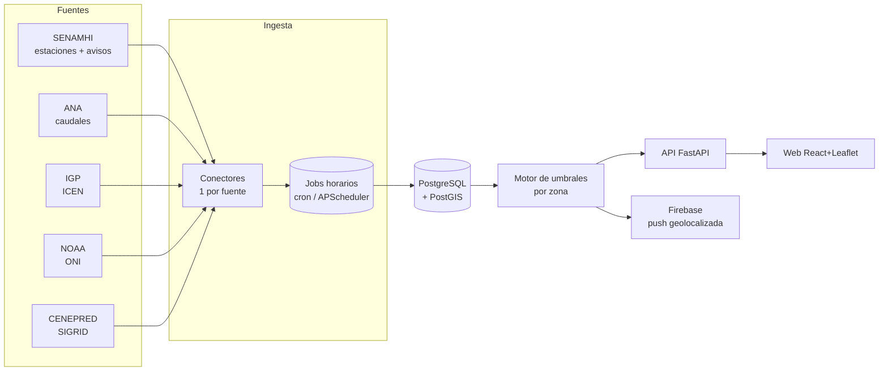

# SIMPAC — Documentación técnica (devs)

> **SIMPAC** — Sistema de Información Meteorológica y Prevención de Anomalías de Cajamarca.
> Plataforma web + app móvil que **centraliza datos hidrometeorológicos de Cajamarca** y
> emite **alertas tempranas de lluvia/crecidas** geolocalizadas.
>
> Este documento es la referencia técnica: arquitectura, conectores de datos, los endpoints
> reales de cada organismo y las partes "peludas" de la ingesta. Para el panorama general
> no técnico, ver la *Pre-documentación general*. Para el catálogo visual de endpoints, ver
> [`fuentes-y-endpoints.html`](./fuentes-y-endpoints.html).

---

## 1. TL;DR / Quickstart

Los prototipos de conectores usan **solo la librería estándar** de Python (3.10+), así que
corren sin instalar nada:

```bash
python backend/demo.py
```

Salida esperada (datos en vivo — foto de Cajamarca): contexto El Niño (ONI/ICEN), caudales
de ríos con su estado de alerta, y la lluvia horaria de una estación automática.

```
NOAA ONI   JJA 2026: +1.80  -> El Niño
IGP  ICEN  2026-05: +1.98  -> Cálido fuerte
Mashcón            Mashcon      18:00     0.13 m³/s  (normal)
Yónan Gore         Jequetepeque 21:00      2.3 m³/s  (normal)
...
CUTERVO (4726A602) — 48 horas ; último 2026/09/06 - 21  precip=0.0 mm  temp=13.3 °C
```

---

## 2. Estructura del repo

```
VigiaFEN/
├─ backend/
│  ├─ connectors/
│  │  ├─ _http.py        # helpers GET/POST (urllib, sin deps)
│  │  ├─ senamhi.py      # estaciones + serie horaria (lluvia/temp)
│  │  ├─ ana.py          # caudales de ríos + estado de alerta por umbral
│  │  ├─ igp.py          # Índice Costero El Niño (ICEN)
│  │  └─ noaa.py         # ONI (contexto ENSO global)
│  ├─ demo.py            # prueba de humo en vivo
│  └─ requirements.txt
└─ docs/
   ├─ README-tecnico.md          (este archivo)
   ├─ fuentes-y-endpoints.html   (catálogo visual de endpoints)
   └─ pre-documentacion-general.html
```

---

## 3. Arquitectura

Principio: **un conector aislado por organismo** que normaliza su fuente a estructuras
simples. Los jobs de ingesta corren periódicamente, guardan en PostgreSQL/PostGIS, y la API
(FastAPI) sirve al frontend (React + Leaflet) y a la app (Firebase push).



### 3.1. Convención de un conector

Cada módulo expone funciones puras que devuelven `@dataclass`/listas; **no** guardan estado
ni tocan la BD (de eso se encargan los jobs). Así son testeables y cacheables.

---

## 4. Verificación de "tiempo real" (importante)

No basta con asumirlo; se verificó contra la hora del sistema (Perú, UTC−5):

| Fuente | Endpoint | Última marca observada | Frecuencia | ¿Tiempo real? |
|---|---|---|---|---|
| SENAMHI (est. automática) | `map_red_graf.php` | `2026/09/06 - 21h` (hora en curso, 21:15) | horaria | **Sí** |
| ANA (caudales) | `ReporteNacionalCaudal` | `HORA` hasta `21:00` (RPT 592-2026) | ~horaria | **Sí** |
| IGP ICEN | `ICEN.txt` | mes en curso | mensual | contexto |
| NOAA ONI | `oni.ascii.txt` | trimestre en curso | mensual | contexto |

**Conclusión:** la lluvia (SENAMHI) y el caudal (ANA) se actualizan a la hora en curso —
suficiente para disparar alertas. ICEN/ONI son contexto estacional (El Niño), no gatillan
alertas inmediatas pero alimentan el modelo predictivo y el titular.

---

## 5. Conectores — referencia de endpoints

### 5.1. SENAMHI — estaciones y lluvia horaria

**Inventario de estaciones** (HTML con un array JS `PruebaTest` embebido):

```
GET https://www.senamhi.gob.pe/mapas/mapa-estaciones-2/?dp=cajamarca
```
```js
{"nom":"AUGUSTO WEBERBAUER","cate":"MAP","lat":-7.1675,"lon":-78.49309,
 "ico":"M","cod":"107028","estado":"REAL"}
```
- `ico`: `M` meteorológica · `H` hidrológica.
- `estado`: `REAL` (convencional, 07/13/19h) · `DIFERIDO` · `AUTOMATICA` (**telemetría horaria** → las útiles para alertas).

**Serie horaria por estación** (config de Highcharts embebida en el HTML, **sin CAPTCHA**):

```
GET .../map_red_graf.php?cod={cod}&estado={estado}&tipo_esta={M|H}&cate={cate}&cod_old={cod_old}
```
El parser extrae `xAxis.categories` (timestamps `YYYY/MM/DD - HH`) y las `series[].data`
(precip mm/h y temp °C). **Gotcha:** los textos vienen con escapes `\uXXXX` del lado del
servidor; se busca por palabra clave antes del escape (`"Precipitaci"`, `"Temperatura"`).

```python
from backend.connectors import senamhi
autos = senamhi.estaciones_automaticas("cajamarca")
serie = senamhi.datos_horarios(autos[0])
print(serie.ultimo, serie.precip_acumulada(24))
```

> ⚠️ **Histórico bloqueado por CAPTCHA.** La pestaña "Tabla" (mensual, desde 2021-10) usa
> Cloudflare Turnstile y postea a `__dt_est_tp_0s3n@mH1.php`. **No se automatiza ni se evade.**
> Para series largas usar PISCO o la descarga oficial. El gráfico de 48 h sí es libre.

**Avisos meteorológicos** (tabla HTML, nivel amarillo/naranja/rojo):
```
GET https://www.senamhi.gob.pe/?p=aviso-meteorologico
```
Columnas: `Aviso · Nro · Emisión · Inicio · Fin · Duración · Nivel`. Filtrar títulos de
"SIERRA NORTE"/Cajamarca. (Conector pendiente — es scraping de tabla.)

### 5.2. ANA — caudales de ríos (⭐ inundaciones)

```
POST https://snirh.ana.gob.pe/onrh/ServicioReportes.asmx/ReporteNacionalCaudal
Content-Type: application/json; charset=UTF-8
body: {pTipoRPT:1, pFecha:"dd/mm/aaaa", pCodAAA:"00", pCodALA:"00", pCodUbigeo:"00"}
```
**Gotchas del ASMX:**
- El cuerpo **no** es JSON estándar (claves sin comillas) — es el string que arma la web.
  Un `{}` vacío devuelve **HTTP 500**; hay que mandar los 5 parámetros. `"00"` = todos.
- `pFecha` es `dd/mm/aaaa`. La respuesta llega como `{"d":[ ... ]}`.

Cada estación trae su **propio umbral** de alerta y emergencia:
```json
{ "DEPARTAMENTO":"Cajamarca","RIO":"Mashcon","ESTACION":"Mashcón",
  "VALOR":"0.13","UNIDADMEDIDA":"m³/s","UALERTA":"14.00","UEMERGENCIA":"18.00",
  "TENDENCIA":"Ascendente","HORA":"18:00","LONGITUD":"-78.4783","LATITUD":"-7.165" }
```
Estado de riesgo (implementado en `ana.EstacionCaudal.estado`):
```
VALOR ≥ UEMERGENCIA  -> emergencia
VALOR ≥ UALERTA      -> alerta
si no                -> normal   (s.d. si falta valor/umbral)
```
Cajamarca aporta ~12 estaciones (Mashcón —río de la ciudad—, Jesús Túnel, Namora Bocatoma,
Corral Quemado, Chotano, Puente Crisnejas, Yónan Gore, Cañad, …). Ojo: `UNIDADMEDIDA` puede
ser `m³/s` (caudal) **o** `m` (nivel).

**Capas del mapa** (visor por cuenca, para contexto/cruce):
```
POST .../VisorPorCuenca/ServicioGeneral.asmx/ListarMapaGEO   -> [{I,D,O,C:[lon,lat]}]
Visor: https://snirh.ana.gob.pe/VisorPorCuenca/?IdVar={N}
```
IdVar: `228` ríos · `46` embalses · `39` emergencias hídricas · `106` SAMAQ (activación de
quebradas/huaycos) · `220` puntos críticos. **39 y 106 son ideales para el cruce con
reportes ciudadanos.**

### 5.3. IGP — ICEN (contexto El Niño Costero)

```
http://met.igp.gob.pe/datos/ICEN.txt        # yy  mm  ICEN  (líneas '%' = comentario)
http://met.igp.gob.pe/datos/ICEN_91_20.txt  # base 1991-2020 (= base NOAA)
http://met.igp.gob.pe/datos/ICENr.txt       # ITCEN: valor reciente/provisional
```
> ⚠️ **HTTP-only** (Apache 2.2, puerto 80). Una web servida por HTTPS **no puede** hacer
> `fetch` a `http://` (mixed content). El **backend descarga y proxyea** el archivo (cachear
> a diario). Categorías del semáforo en `igp.categoria()`.

### 5.4. NOAA / CPC — ONI (contexto ENSO global)

```
https://www.cpc.ncep.noaa.gov/data/indices/oni.ascii.txt   # SEAS YR TOTAL ANOM (ANOM = ONI)
```
Texto plano, HTTPS, sin auth. La fuente más limpia. `anom ≥ 0.5` → El Niño; `≤ -0.5` → La Niña.

### 5.5. CENEPRED — SIGRID (peligro/riesgo, referencia)

Visor ArcGIS JS 3.41. Config del escenario:
```
POST https://sigrid.cenepred.gob.pe/sigridv3/entorno/traer
  -> { extension, mapa_base, shape(WKT), capas_activas:"cartografiaPeligros=[…];
       cartografiaRiesgos=[…]; elementosExpuestos=[…]" }
```
Capas servidas por **ArcGIS REST (MapServer/FeatureServer)** → `identify`/`query` o WMS.
Uso: capa de contexto de riesgo y para el **cruce** (¿el reporte cae en zona de peligro alto?).
No es tiempo real. *Pendiente:* capturar la URL exacta del MapServer activando una capa.

### 5.6. ENFEN — estado de alerta El Niño Costero

Sitio WordPress (`enfen.imarpe.gob.pe`). Vía: `GET /wp-json/wp/v2/posts?_fields=id,date,title,link`
(comunicados; PDFs por `?wpdmdl={id}`). El valor numérico del índice ya sale del IGP (5.3).
*Pendiente:* no fue accesible desde el entorno de captura (DNS/red); validar desde producción.

---

## 6. Motor de alertas y predicción

**Alertas (reactivas, tiempo real):** el motor compara, por zona de Cajamarca, las entradas
horarias contra umbrales:
- **Lluvia** (SENAMHI automáticas): umbral configurable por estación (mm/h y acumulado 24 h).
- **Caudal** (ANA): usa los umbrales `UALERTA`/`UEMERGENCIA` que la propia fuente entrega.
- **Aviso oficial** (SENAMHI): eleva el nivel cuando el aviso aplica a la zona.

El nivel resultante (normal/aviso/alerta/emergencia) alimenta el titular, el mapa y la push
(Firebase). En fase 2 se **cruza con los reportes ciudadanos** para ponderar su confianza
(un reporte en zona con alerta oficial pesa más).

**Predicción (fase 2+):** con la serie horaria histórica por estación (48 h de SENAMHI +
acumulación propia en la BD) se puede:
1. Empezar simple: **tendencia + umbral** (p. ej. precip acumulada creciente + pronóstico
   de aviso) → probabilidad de crecida en las próximas horas.
2. Luego un modelo de series de tiempo por estación (el ICEN/ONI entran como features de
   contexto estacional El Niño). Guardar histórico propio es clave: las fuentes solo dan
   ventanas cortas en tiempo real (SENAMHI 48 h) y el resto está tras CAPTCHA.

---

## 7. Estrategia de adquisición y buenas prácticas

Orden de preferencia por estabilidad: **API/archivo abierto → API interna (sniffing) →
scraping HTML/PDF.**

| Fuente | Método | Nota |
|---|---|---|
| NOAA ONI | archivo abierto (HTTPS) | trivial |
| IGP ICEN | archivo abierto (**HTTP**) | proxyear desde backend |
| ANA caudal | API interna `.asmx` (POST JSON) | payload exacto, ver 5.2 |
| SENAMHI estaciones/serie | HTML con JSON/Highcharts embebido | scraping estructurado |
| SENAMHI avisos | scraping de tabla | pendiente |
| CENEPRED | ArcGIS REST | referencia |

Reglas:
- **Backend como proxy** siempre (evita CORS y mixed-content; obligatorio para IGP).
- **Caché + rate limit**: todo se actualiza por hora; no martillar los servidores del Estado.
- **User-Agent identificable**; revisar términos de uso y `robots.txt`.
- **Conectores aislados con tests**: las APIs internas cambian sin aviso.
- **Atribución visible** de la fuente en cada dato.
- **Nunca evadir CAPTCHA** (histórico de SENAMHI queda fuera de alcance).

---

## 8. Pendientes

- [ ] Conector de **avisos** SENAMHI (scraping de tabla + filtro Cajamarca).
- [ ] Conector **ENFEN** (`wp-json`) validado desde producción.
- [ ] URL exacta del **MapServer de CENEPRED** (enumerar capas de peligro por lluvia/inundación).
- [ ] Persistencia (PostGIS) + jobs horarios (APScheduler/cron) para acumular histórico propio.
- [ ] API FastAPI + esquema de la BD (ver pre-documentación, sección Modelo de datos).
- [ ] Reejecutar la verificación en **temporada de lluvias (dic–abr)**, cuando disparan los umbrales.

---

*Endpoints capturados por inspección de red de sitios públicos el 2026-09-06. Sujetos a
cambios del lado de cada organismo; por eso cada fuente vive en su propio conector con tests.*
